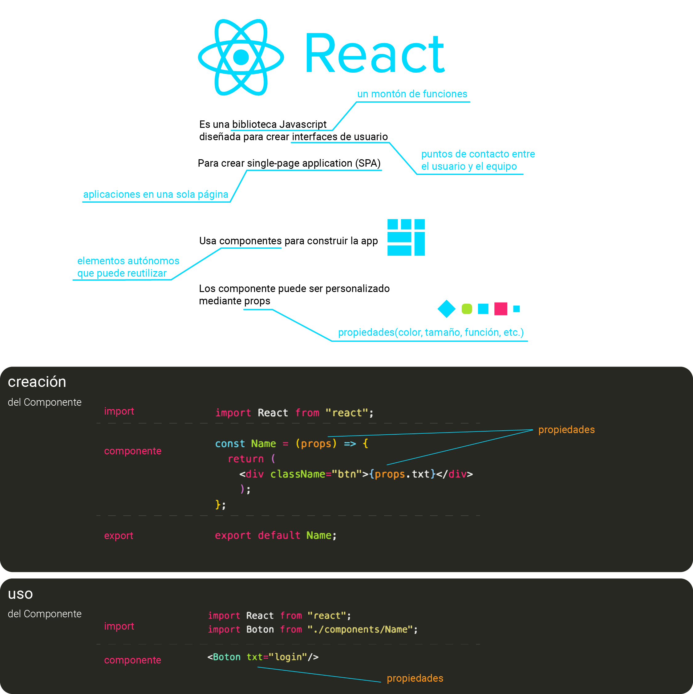
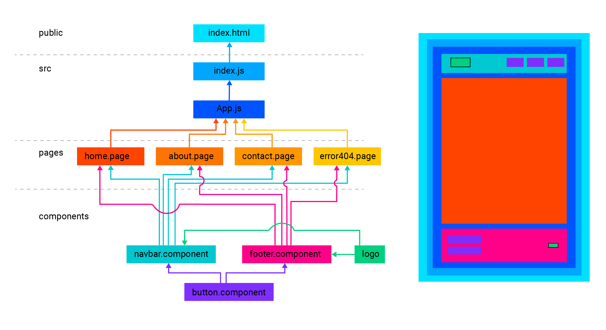

# Guia React

## ¿cómo funciona react?



## instalar node

instalar [https://nodejs.org/es/download/](https://nodejs.org/es/download/)

```console
node -v        # verificar node             
npm -v         # verificar npm              
```

## instalar react

```console
npm install -g create-react-app      # instalar react de manera global
npm view react version               # verificar react
```

## plugings VSCode

1. Prettier - Code formatter

2. ES7 React/Redux/GraphQL/React-Native snippets

3. Auto Import — ES6 & TS

4. styled-components-snippets - Jon Wheeler

5. MUI Snippets

extras [https://medium.com/canariasjs/tips-para-mejorar-tu-desarrollo-con-react-y-vscode-b4a09431d8eb](https://medium.com/canariasjs/tips-para-mejorar-tu-desarrollo-con-react-y-vscode-b4a09431d8eb)

---

## crear proyecto

```console
    create-react-app nombre-proyecto    # crear desde local
npx create-react-app nombre-proyecto    # crear desde internet
```

```console
npm start                               # levantar servidor
```

## instalar librerias

```console
npm i node-sass@4.13.0                                    # SASS
npm i react-router-dom@5                                  # Router DOM
npm install --save styled-components                      # StyledComponents  
npm install @mui/material @emotion/react @emotion/styled  # material ui
npm install @mui/icons-material                           # material icons
```

## repositorio

React ya inició un repo

```console
git add .                       # captura los cambios
git commit -m 'create project'  # agrega los cambios
```

```console
brew install gh                                           # instalar Github CLI
gh repo create usuario/repo --public                      # crear repo en github

git remote add origin https://github.com/usuario/repo.git # conectar con repo
git remote -v                                             # verificar conexión
git branch --list                                         # ver ramas
git branch -m main                                        # cambiar nombre
git push -u origin main                                   # subir
```

---

## structure

```console
root
|
|──.git
|──.gitignore
|
|──package-lock.json
|──package.json
|
|──README.md
|
|──node_modules
|
|──public
|   |──favicon.ico
|   |──index.html
|   |──logo192.png
|   |──logo512.png
|   |──manifest.json
|   └──robots.txt
|
└──src
    |──App.css
    |──App.js
    |──App.test.js
    |
    |──index.css
    |──index.js
    |
    |──logo.png
    |──reportWebVitals.js
    |──setupTests.js
    |
    |──assets
    |   |──data listApiData.js
    |   └──img
    |
    |──pages
    |   |
    |   |──home
    |   |   |──home.page.jsx
    |   |   └──home.styles.scss
    |   |
    |   |──about
    |   |   |──about.page.jsx
    |   |   └──about.styles.scss
    |   |
    |   └──contact
    |        |──contact.page.jsx
    |        └──contact.styles.scss
    |
    └──components
        |
        |──navbar
        |   |──navbar.page.jsx
        |   └──navbar.styles.scss
        |
        |──button
        |   |──button.page.jsx
        |   └──button.styles.scss
        |
        └──footer
            |──footer.page.jsx
            └──footer.styles.scss
```

## sistema de componentes



## components

para crear componentes **funcionales**. (atajos)

```jsx
rafce      # React Arrow Function Export Component
rafc       # React Arrow Function Component

rfce       # React Functional Export Component
rfc        # React Functional Component

rcce       # React Class Export Component
rcc        # React Class Component

```

```jsx
// rafce      # React Arrow Function Export Component

import React from "react";

const Name = () => {
  return <div>Name</div>;
};

export default Name;
```

```jsx
// rafc       # React Arrow Function Component

import React from "react";

export const Name = () => {
  return <div>Name</div>;
};
```

```jsx
// rfce       # React Functional Export Component

import React from "react";

function Name() {
  return <div>Name</div>;
}

export default Name;
```

```jsx
// rfc        # React Functional Component

import React from "react";

export default function Name() {
  return <div>Name</div>;
}
```

```jsx
// rcce       # React Class Export Component

import React, { Component } from "react";

export class Name extends Component {
  render() {
    return <div>Name</div>;
  }
}

export default Name;
```

```jsx
// rcc        # React Class Component

import React, { Component } from "react";

export default class Name extends Component {
  render() {
    return <div>Name</div>;
  }
}

```

## rutas

En index.js

```jsx
import React from 'react';
import ReactDOM from 'react-dom/client';
import { BrowserRouter as Router } from 'react-router-dom';
import App from './App';

const root = ReactDOM.createRoot(document.getElementById('root'));

root.render(
  <React.StrictMode>
      <Router>
        <App />
      </Router>
  </React.StrictMode>
);
```

En App.js

```jsx
import React from 'react';
import { Route, Switch, Redirect } from "react-router-dom";

import Home from "./pages/home/home.page";
import About from "./pages/about/about.page";
import Contact from "./pages/contact/contact.page";
import Error404 from "./pages/error404/error404.page";

import Navbar from './components/navbar/navbar.component';
import Footer from "./components/footer/footer.component";

import './App.css';

const App = () => {
  return (
    <>
        <Navbar />

        <Switch>
          <Route exact path="/" component={Home} />
          <Route exact path="/home">{<Redirect to="/" />}</Route>
          <Route exact path="/about" component={About} />
          <Route exact path="/contact" component={Contact} />
          <Route path="*" component={Error404} />
        </Switch>

        <Footer />
      
    </>);
};

export default App;
```

En home.page.jsx

```jsx
import React from "react";

const Home = () => {
  return <div>Home</div>;
};

export default Home;
```

En about.page.jsx

```jsx
import React from "react";

const About = () => {
  return <div>About</div>;
};

export default About;
```

En contact.page.jsx

```jsx
import React from "react";

const Contact = () => {
  return <div>Contact</div>;
};

export default Contact;
```

En error404.page.jsx

```jsx
import React from "react";

const Error404 = () => {
  return <div>Error404</div>;
};

export default Error404;
```
